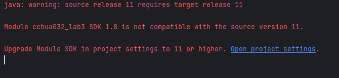

# Lab 2

## Student information

* Full name:
* E-mail:
* UCR NetID:
* Student ID:

## Answers

* (Q1) Verify the file size and report the running time.
* - Copied 2271210910 bytes from 'AREAWATER.csv' to 'output.txt' in 9.185758 seconds
* (Q2) Report the running time of the copy command.
* - Milliseconds      : 888
    Ticks             : 8888340
    TotalDays         : 1.02874305555556E-05
    TotalHours        : 0.000246898333333333
    TotalMinutes      : 0.0148139
    TotalSeconds      : 0.888834
    TotalMilliseconds : 888.834
* (Q3) How do the two numbers compare? (The running times of copying the file through your program and the operating system.) Explain IN YOUR OWN WORDS why you see these results.
* -
* (Q4) Copy the output of this command.
* -
* (Q5) What is the total capacity of this cluster and how much of it is free? and how many live data nodes are there?
* -
* (Q6) What is the output of this command?
* - ``` 
    cs167@class-146:~$ hdfs dfs -ls
    Found 2 items
    -rw-r--r--   3 cs167 supergroup          0 2024-01-25 22:05 cchua032.txt
    -rw-r--r--   3 cs167 supergroup          0 2024-01-25 17:30 cespa014.txt
    ```
* (Q7) Does the program run after you change the default file system to HDFS? What is the error message, if any, that you get?
* -
* 
* (Q8) Use your program to test the following cases and record the running time for each case.
* - 
* (Q9) Test your program on two files, one file stored on the local file system, and another file stored on HDFS. Compare the running times of both tasks. What do you observe?
